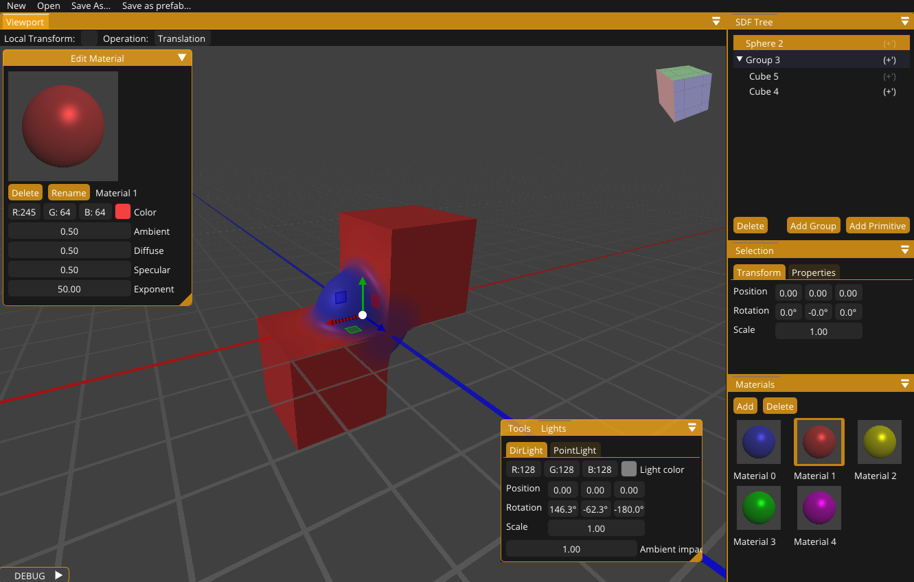
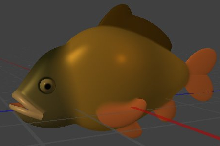
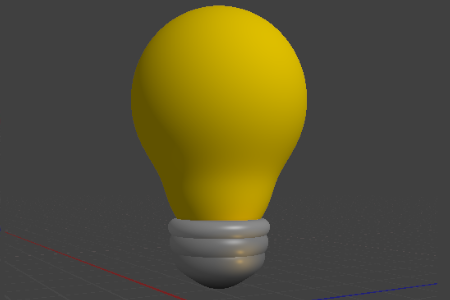
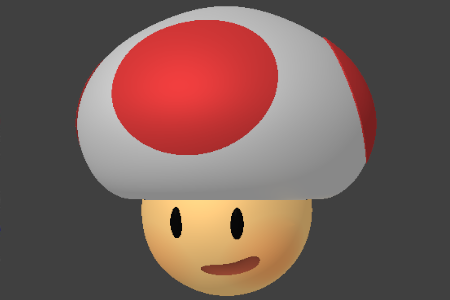

# Resin
Resin is a 3D model editor based on signed distance functions (SDFs). The application uses constructive solid geometry
(CSG) technique to allow for creation of visually complex objects by applying boolean operators on primitive ones. 
Resin also supports exporting models to a triangle meshes, allowing further processing
in popular 3D modeling software. 🔗 [See the latest releases](https://github.com/gizmokis/resin/releases).  

## Gallery

|                                  |                                  |                                  |
| --------------------------------------------- | ----------------------------------------------- | --------------------------------------------- |
|  |  |  |

## Development 

To see how to configure, build and debug the code follow the [Setup Guide](docs/dev/SetupGuide.md). If you want to learn
more how to work with the repository see the [Working With The Repository](docs/dev/WorkingWithTheRepository.md)
guide.

